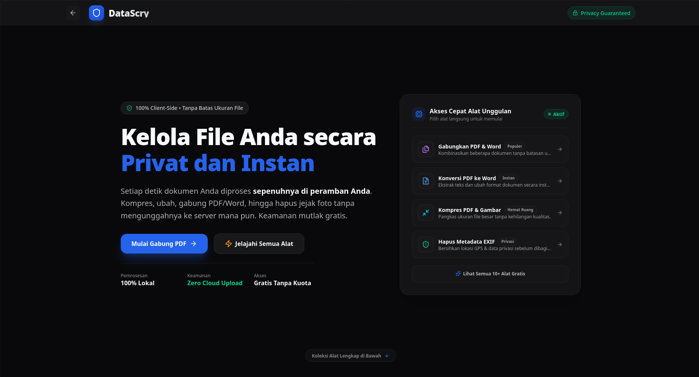

<div align="center">
  <br /><br />
  <h1>DataScry</h1>
  <p><strong>Your All-in-One Client-Side Toolkit for Files and Privacy</strong></p>
  
  
  <p>
    <a href="https://nextjs.org/"></a>
    <a href="https://tailwindcss.com/"></a>
    <a href="https://react.dev/"></a>
  </p>
</div>

---

## 🌟 Overview

**DataScry** is a modern, fast, and feature-rich web application designed to help you manipulate files and protect your privacy securely. By leveraging modern web technologies, **all data processing happens directly in your browser**.

No files are ever uploaded to a server, ensuring your data remains 100% private, offline-capable, and secure.

### 🔮 The Philosophy Behind "DataScry"

- **Data (Digital Sovereignty)**: Your documents, contracts, and photos represent your most valuable assets. Data is your identity and private property that should never be stored on unknown third-party servers.
- **Scry (Revealing the Hidden)**: Stemming from the ancient art of _scrying_ (revealing what is concealed beneath the surface). DataScry acts as a digital mirror: revealing hidden EXIF metadata, GPS traces, and internal file structures, granting you absolute control to purify, convert, and manage your files safely.

## ✨ Features

DataScry offers a comprehensive suite of tools built into a seamless, unified dark-mode interface:

- **📄 Word Tools**:
  - **🔗 Merge Word (.docx)**: Combine multiple Word documents into a single cohesive `.docx` file 100% locally.
  - **📝 Word to PDF**: Convert `.docx` files to PDF with clean local rendering.
  - **📑 PDF to Word**: Extract and convert PDF documents into editable Word files.
- **📑 PDF Tools**:
  - **🖼️ JPG to PDF**: Compile multiple JPG, PNG, or WebP images into a properly scaled, standard A4/Letter PDF document with custom margins, ordering, and orientation.
  - **📄 PDF to JPG**: Extract high-resolution images from each page of your PDF documents.
  - **✂️ Split PDF**: Extract specific pages or split multi-page PDF documents.
  - **🔗 Merge PDF**: Seamlessly combine multiple PDF files into one.
- **🛡️ Privacy & Security Tools**:
  - **🛡️ Scrub EXIF Data**: Strip GPS coordinates, camera serial numbers, and personal metadata before sharing photos online.
  - **🗂️ Metadata Viewer**: Inspect embedded metadata within images and documents.
  - **🖼️ Image Compress**: Optimize and compress images locally without compromising visual quality.

## 🔒 Privacy First

We believe your data is yours alone. That's why DataScry is built with a strict **Privacy-First** architecture:

- **Zero Server Uploads**: Every tool runs locally on your device via client-side scripting.
- **Offline Capable**: Because it runs in the browser, you can use these tools even on a spotty connection once loaded.
- **Safe & Secure**: Open-source transparency means you can verify exactly what happens to your files.

## 🛠️ Tech Stack

- **Framework**: [Next.js](https://nextjs.org/) (App Router)
- **Styling**: [Tailwind CSS v4](https://tailwindcss.com/)
- **Icons**: [Lucide React](https://lucide.dev/)
- **Core Libraries**:
  - `browser-image-compression` for images.
  - `pdf-lib` & `pdfjs-dist` for PDF manipulation.
  - `exifreader` for metadata extraction.
  - `jszip` & `idb` for browser storage and zipping.

## 🚀 Getting Started

To run this project locally, follow these steps:

### 1. Clone the repository

```bash
git clone https://github.com/NXRts/DataScry.git
cd DataScry
```

### 2. Install dependencies

```bash
npm install
# or yarn install / pnpm install / bun install
```

### 3. Run the development server

```bash
npm run dev
# or yarn dev / pnpm dev / bun dev
```

Open [http://localhost:3000](http://localhost:3000) with your browser to see the app in action!

## 🤝 Contributing

Contributions are what make the open-source community such an amazing place to learn, inspire, and create. Any contributions you make are **greatly appreciated**.

1. Fork the Project
2. Create your Feature Branch (`git checkout -b feature/AmazingFeature`)
3. Commit your Changes (`git commit -m 'Add some AmazingFeature'`)
4. Push to the Branch (`git push origin feature/AmazingFeature`)
5. Open a Pull Request

## 📜 License

Distributed under the MIT License. See `LICENSE` for more information.

---

<p align="center">Made with ❤️ for Privacy and Efficiency.</p>
